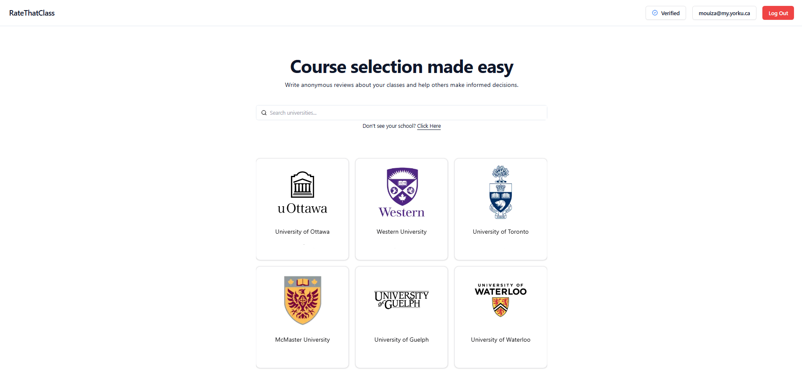

<div align="center">
    
</div>
<h1 align="center">
    Rate That Class
</h1>

A web application that allows users to anonymously create course reviews for their respective post-secondary schools and ease their struggles within the course selection process.

Try it now: [https://ratethatclass.com/](https://ratethatclass.com/)

# Current Development

- Cron job to run scraper on cloud every 4 months.
- Create management account functionality
  - Handle reports.
  - Adding universities + file upload.
  - View logs of last cron job / execute cron job (manage schedules + clusters)
- Develop backend server test cases.

# Overview

This is a web application that students can use to evaluate courses and find courses that meet their expectations. Each review is categorized by its school, department, course, and professor. If any of these categories are not listed, the user can add them to the database in order to complete their course review.

Each course review is anonymous and can be deleted at any time if the user made the review while signed in. Users can also upvote or downvote other reviews anonymously.

This web application only allows validated post-secondary students to register which is done through verifying emails from a set of whitelisted domains and a confirmation email.



# Features

- 🎓 **Anonymous Course Reviews**: Create detailed, anonymous reviews for courses at your post-secondary institution
- 📊 **4-Point Rating System**: Rate courses on Overall Quality, Easiness, Interest Level, and Usefulness (1-5 scale)
- 🏫 **University-Organized & Smart Filtering**: Browse reviews by university, department, course, and professor with filtering by term, delivery method, and sorting options
- 🔐 **Verified Students Only**: Email domain verification ensures only legitimate post-secondary students can join
- 🗳️ **Community Voting**: Upvote and downvote reviews to highlight the most helpful content
- 📱 **Mobile-Friendly**: Works seamlessly on desktop and mobile devices
- 💬 **Detailed Reviews**: Share insights about course content, professors, and advice for future students, plus include grade, workload, textbook usage, and evaluation methods
- 👤 **Review Management**: View and manage your own reviews from your profile
- 🚨 **Report System**: Report inappropriate content to maintain community standards
- 📈 **Live Statistics**: Real-time course ratings and review counts
- 🔍 **SEO Optimized**: Google SEO optimized with Server-Side Rendering (SSR) and dynamic sitemap generation

# Usage Flow

1. **Register & Verify**: Sign up with your university email and verify your account
2. **Browse Universities**: Select your post-secondary institution from the list
3. **Explore Departments**: Navigate to your department and find your course
4. **Read Reviews**: View existing reviews with ratings, comments, and filtering options
5. **Create Review**: Add your own anonymous review with ratings and detailed feedback
   - Rate the course on 4 dimensions (Overall, Easiness, Interest, Usefulness)
   - Enter course details (professor, grade, delivery method, workload, textbook usage)
   - Write comments about course content, professor, and advice for future students
   - Review and confirm your submission
6. **Engage Community**: Vote on helpful reviews and manage your contributions
7. **Discover Courses**: Use insights to make informed decisions about future course selections

# Project Structure

```
rate-that-class/
├── client/                 # Next.js frontend application
│   ├── src/
│   │   ├── app/           # Next.js app router pages
│   │   ├── components/    # Reusable UI components
│   │   │   ├── auth/      # Authentication forms
│   │   │   ├── common/    # Shared components
│   │   │   ├── display/   # Data display components
│   │   │   ├── forms/     # Form components and steps
│   │   │   └── ui/        # Base UI components (shadcn/ui)
│   │   ├── contexts/      # React context providers
│   │   ├── firebase/      # Firebase client configuration
│   │   ├── hooks/         # Custom React hooks
│   │   ├── lib/           # Utility functions and constants
│   │   ├── requests/      # API request functions
│   │   └── types/         # TypeScript type definitions
│   ├── public/            # Static assets (images, icons)
│   └── package.json       # Frontend dependencies
├── server/                # Express.js backend API
│   ├── src/
│   │   ├── routes/        # API endpoint handlers
│   │   │   ├── course.ts      # Course-related endpoints
│   │   │   ├── review.ts      # Review CRUD and voting
│   │   │   ├── user.ts        # User management
│   │   │   ├── university.ts  # University data
│   │   │   ├── department.ts  # Department endpoints
│   │   │   ├── professor.ts   # Professor management
│   │   │   └── report.ts      # Content reporting
│   │   ├── db/            # Database queries and connection
│   │   ├── types.ts       # Backend type definitions
│   │   └── index.ts       # Express server entry point
│   ├── middleware/        # Authentication middleware
│   ├── firebase/          # Firebase admin configuration
│   └── package.json       # Backend dependencies
├── init-db/               # PostgreSQL database setup
│   └── init-db.sql        # Database schema and initial data
├── scraper/               # University data collection tools
│   ├── scrapers/          # Individual university scrapers
│   │   ├── base_scraper.py    # Base scraper class
│   │   └── *_scraper.py       # University-specific scrapers
│   ├── scraped_data/      # Storage for scraped university data
│   │   └── *_data.json        # University-specific scraped data
│   ├── logs/              # Scraper execution logs
│   │   └── scraper_YYYYMMDD_HHMMSS.log  # e.g. scraper_20250604_200750.log
│   ├── database.py        # Database operations and models
│   ├── logger.py          # Logging configuration
│   ├── utils.py           # Shared utility functions
│   ├── main.py           # Scraper orchestration
│   └── web_crawler.py    # Web crawling functionality
├── docker-compose.yml     # Multi-container Docker setup
└── README.md              # Project documentation
```

# Tech Stack

## Frontend

- **Framework**: Next.js 15.1.3 (React)
- **Styling**: Tailwind CSS + shadcn/ui components
- **Authentication**: Firebase Auth
- **Language**: TypeScript

## Backend

- **Runtime**: Node.js
- **Framework**: Express.js
- **Database**: PostgreSQL
- **Authentication**: Firebase Admin SDK
- **Language**: TypeScript

## Infrastructure

- **Frontend Hosting**: [Vercel](https://vercel.com/)
- **Backend Hosting**: [Render](https://render.com/)
- **Database Hosting**: [Supabase](https://supabase.com/)
- **Image Hosting**: [Cloudinary](https://cloudinary.com/)
- **Containerization**: Docker & Docker Compose

# Getting Started

This application is designed to run with Firebase and cannot be run locally due to Firebase auth dependencies.

## Prerequisites

- Running Docker Daemon
- Firebase Project with auth enabled

## Installing

1. If you don't have docker, you can find the installation instructions [here](https://docs.docker.com/get-started/get-docker/)

2. Install the project by cloning this repository: `git clone git@github.com:mouizahmed/ratethatclass.git`

3. Configure Firebase:

   **Client-side Configuration (Frontend):**

   - Go to [Firebase Console](https://console.firebase.google.com/)
   - Create a new project or use an existing one
   - Enable Authentication in your Firebase project
   - Go to Project Settings > General and copy your web app configuration
   - In `docker-compose.yml`, replace the client Firebase environment variables:
     - `NEXT_PUBLIC_FIREBASE_API_KEY`
     - `NEXT_PUBLIC_FIREBASE_AUTH_DOMAIN`
     - `NEXT_PUBLIC_FIREBASE_PROJECT_ID`
     - `NEXT_PUBLIC_FIREBASE_STORAGE_BUCKET`
     - `NEXT_PUBLIC_FIREBASE_MESSAGING_SENDER_ID`
     - `NEXT_PUBLIC_FIREBASE_APP_ID`

   **Server-side Configuration (Firebase Admin SDK):**

   - Go to Project Settings > Service Accounts
   - Click "Generate new private key" to download a JSON file
   - Extract the following values from the JSON file and add them to `docker-compose.yml`:
     - `CLIENT_EMAIL` (from `client_email`)
     - `CLIENT_ID` (from `client_id`)
     - `CLIENT_X509_CERT_URL` (from `client_x509_cert_url`)
     - `PRIVATE_KEY` (from `private_key` - keep the quotes and newlines)
     - `PRIVATE_KEY_ID` (from `private_key_id`)
     - `PROJECT_ID` (from `project_id`)

4. Start the application:
   ```bash
   docker-compose up -d
   ```

# License

[AGPL](https://github.com/mouizahmed/ratethatclass/blob/master/LICENSE)
